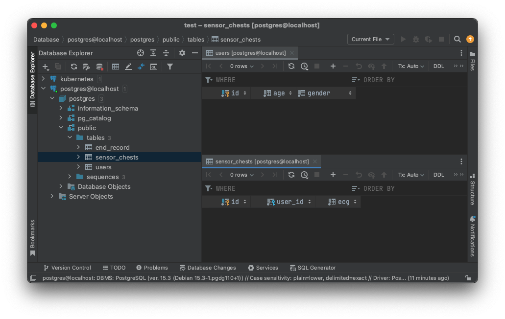

# Database Settings

* This configuration is based on open source relational database, [PostgreSQL](https://www.postgresql.org/).
  * Almost all SQL query is same as standard SQL query.
  * Function and some specific method are quite different from other database like MySQL, MariaDB.
* Locally, this setting is based on docker container.

### Docker container settings

* First, clean docker volume
    ```shell
  docker volume prune
  ```

* Pull postgres docker image.
  ```shell
    docker pull postgres:latest 
    ```
  
* Execute docker container process
  ```shell
    docker run \ 
      -e POSTGRES_PASSWORD=postgres \ 
      -p 5432:5432 \
      --rm postgres \
      --name postres \
      postgres:latest -d
    ```
  * `--rn`: if you stop docker container process, it is automatically removed by docker daemon.
  * `--name`: assign docker container processor name.
  * `-d`: execute docker container in background.
  * `-e`: environment options
    * `POSTGRES_PASSWORD`: essential environment variable.
    * for more details, visit official [information](https://hub.docker.com/_/postgres).

# Python ORM(feat. sqlAlchemy)

* `models.py`: define database table.
* `database.py`: define basic session objects.

### DDL by [sqlAlchemy](https://www.sqlalchemy.org/)

* sqlAlchemy is one of the most famous python ORM libraries.
* This library maps python classes to database tables.
    ```python
    class User(Base):
        __tablename__ = "users"
    
        id = Column(
            BigInteger,
            primary_key=True
        )
        age = Column(
            BigInteger,
            nullable=False,
        )
        gender = Column(
            String(255),
            nullable=False,
        ) 
    
        def __repr__(self) -> str:
            return f"User(id={self.id}, age={self.age}, gender={self.gender})"
  ```
  The class above is same as follows:
  ```sql
    CREATE TABLE public.user (
      id BIGSERIAL PRIMARY KEY, 
      age BIGINT NOT NULL , 
      connection_id VARCHAR(255) NOT NULL
    );
    ```
  
* FK(foreign key) mapping can be as follows:
    ```python
    class SensorChest(Base):
        __tablename__ = "sensor_chests"
    
        id = Column(
            BigInteger,
            primary_key=True
        )
        user_id = Column(
            BigInteger,
            ForeignKey("users.id"),
            nullable=False,
        )
        ecg = Column(
            Double,
            nullable=False,
        ) 
    
        def __repr__(self) -> str:
            return f"SensorChest(id={self.id}, age={self.age}, gender={self.gender})"
  ```
  The class above is same as follows:
  ```sql
  CREATE TABLE PUBLIC.sensor_chests (
    id      BIGSERIAL PRIMARY KEY,
    user_id BIGINT NOT NULL REFERENCES PUBLIC.users,
    ecg     DOUBLE PRECISION NOT NULL
  ); 
  ```
  
* Apply table to database.
  * To apply table defined by python class, execute python interpreter first.
  * First, you need to go `src/` directory and excute `python` or `ipython` to execute python shell.
  * Then, execute statements below.

    ```python
    from db.database import engine
    from db.models import Base
  
    Base.metadata.create_all(engine)
    ```
  * To check results, you can use database IDE. I recommended as follows:
    
    <p text-align="center">
      
    </p>
  
    * For windows: [HeidSQL](https://www.heidisql.com/)
    * For mac: [DBeaver](https://dbeaver.io/), [DataGrip](https://www.jetbrains.com/datagrip/?source=google&medium=cpc&campaign=15034927843&term=datagrip&content=555122603676&gad=1&gclid=CjwKCAjw67ajBhAVEiwA2g_jEDBIp6J8h94g-9evkxsJ4txvPOcK85C5y8GPFpuWH4gAwMUmtlXTxBoCyjwQAvD_BwE) (not free)
      * For about DataGrip, if you register student promotion to JetBrain, you can use it for free.

### Save to Database

To store data to database, you need to follow steps below.

1. First, open database session(connection).
  * You can use `get_context_db()` to make db session.
  * This function can be used by context manager; `with`
    ```python
    with get_context_db() as db:
        pass
    ```

2. Add data which you want to store to db session.
  ```python
  from db import models
  data = models.User(
      age=25,
      gender="male",
  )
  db.add(data)
  ```

  * Even though you successfully executed `db.add(data)`, the `data` is not yet stored in database.
  * Until you execute `commit()` to db session, data is not stored in database.

3. Commit db session.

  ```python
  db.commit()
  ```

4. Close db connection.

  * Because you already use context manager, you do not care of closing db session.
  * When context manager that is managing db session finishes, db session is automatically closed.
